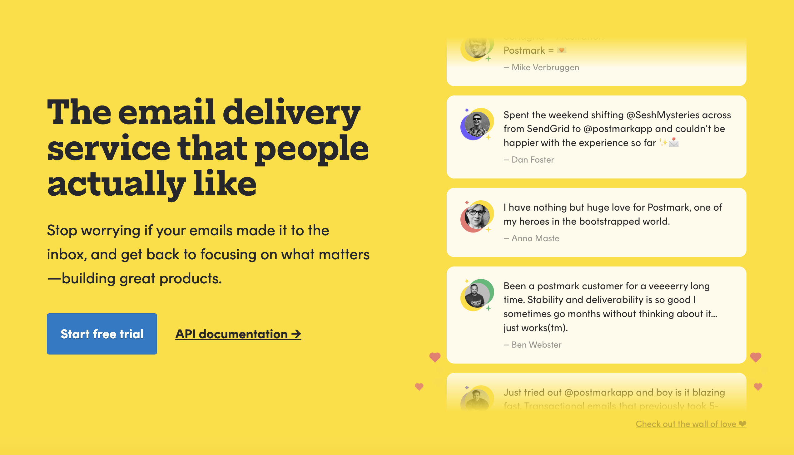

<div align="left">

[](https://postmarkapp.com)

# [Postmark](https://postmarkapp.com)

Postmark makes sending and receiving email
incredibly easy.


</div>

## Requirements

Building the API client library requires:

1. Java 1.8+
2. Maven (3.8.3+)/Gradle (7.2+)

If you are adding this library to an Android Application or Library:

3. Android 8.0+ (API Level 26+)

## Installation<a id="installation"></a>
<div align="center">
  <a href="https://konfigthis.com/sdk-sign-up?company=Postmark&language=Java">
    
  </a>
</div>

### Maven users

Add this dependency to your project's POM:

```xml
<dependency>
  <groupId>com.konfigthis</groupId>
  <artifactId>postmark-java-sdk</artifactId>
  <version>1.0.0</version>
  <scope>compile</scope>
</dependency>
```

### Gradle users

Add this dependency to your `build.gradle`:

```groovy
// build.gradle
repositories {
  mavenCentral()
}

dependencies {
   implementation "com.konfigthis:postmark-java-sdk:1.0.0"
}
```

### Android users

Make sure your `build.gradle` file as a `minSdk` version of at least 26:
```groovy
// build.gradle
android {
    defaultConfig {
        minSdk 26
    }
}
```

Also make sure your library or application has internet permissions in your `AndroidManifest.xml`:

```xml
<!--AndroidManifest.xml-->
<?xml version="1.0" encoding="utf-8"?>
<manifest xmlns:android="http://schemas.android.com/apk/res/android"
    xmlns:tools="http://schemas.android.com/tools">
    <uses-permission android:name="android.permission.INTERNET"/>
</manifest>
```

### Others

At first generate the JAR by executing:

```shell
mvn clean package
```

Then manually install the following JARs:

* `target/postmark-java-sdk-1.0.0.jar`
* `target/lib/*.jar`

## Getting Started

Please follow the [installation](#installation) instruction and execute the following Java code:

```java
import com.konfigthis.client.ApiClient;
import com.konfigthis.client.ApiException;
import com.konfigthis.client.ApiResponse;
import com.konfigthis.client.Postmark;
import com.konfigthis.client.Configuration;
import com.konfigthis.client.auth.*;
import com.konfigthis.client.model.*;
import com.konfigthis.client.api.BouncesApiApi;
import java.util.List;
import java.util.Map;
import java.util.UUID;

public class Example {
  public static void main(String[] args) {
    Configuration configuration = new Configuration();
    configuration.host = "http://api.postmarkapp.com";
    
    configuration.serverToken  = "YOUR API KEY";
    Postmark client = new Postmark(configuration);
    Long bounceid = 56L; // The ID of the Bounce to activate.
    try {
      Object result = client
              .bouncesApi
              .activateBounce(bounceid)
              .execute();
    } catch (ApiException e) {
      System.err.println("Exception when calling BouncesApiApi#activateBounce");
      System.err.println("Status code: " + e.getStatusCode());
      System.err.println("Reason: " + e.getResponseBody());
      System.err.println("Response headers: " + e.getResponseHeaders());
      e.printStackTrace();
    }

    // Use .executeWithHttpInfo() to retrieve HTTP Status Code, Headers and Request
    try {
      ApiResponse<Object> response = client
              .bouncesApi
              .activateBounce(bounceid)
              .executeWithHttpInfo();
      System.out.println(response.getResponseBody());
      System.out.println(response.getResponseHeaders());
      System.out.println(response.getStatusCode());
      System.out.println(response.getRoundTripTime());
      System.out.println(response.getRequest());
    } catch (ApiException e) {
      System.err.println("Exception when calling BouncesApiApi#activateBounce");
      System.err.println("Status code: " + e.getStatusCode());
      System.err.println("Reason: " + e.getResponseBody());
      System.err.println("Response headers: " + e.getResponseHeaders());
      e.printStackTrace();
    }
  }
}

```

## Documentation for API Endpoints

All URIs are relative to *http://api.postmarkapp.com*

Class | Method | HTTP request | Description
------------ | ------------- | ------------- | -------------
*BouncesApiApi* | [**activateBounce**](docs/BouncesApiApi.md#activateBounce) | **PUT** /bounces/{bounceid}/activate | Activate a bounce
*BouncesApiApi* | [**getBounce**](docs/BouncesApiApi.md#getBounce) | **GET** /bounces/{bounceid} | Get a single bounce
*BouncesApiApi* | [**getDeliveryStats**](docs/BouncesApiApi.md#getDeliveryStats) | **GET** /deliverystats | Get delivery stats
*BouncesApiApi* | [**getDump**](docs/BouncesApiApi.md#getDump) | **GET** /bounces/{bounceid}/dump | Get bounce dump
*BouncesApiApi* | [**listBounces**](docs/BouncesApiApi.md#listBounces) | **GET** /bounces | Get bounces
*InboundRulesApiApi* | [**createTrigger**](docs/InboundRulesApiApi.md#createTrigger) | **POST** /triggers/inboundrules | Create an inbound rule trigger
*InboundRulesApiApi* | [**deleteSingleTrigger**](docs/InboundRulesApiApi.md#deleteSingleTrigger) | **DELETE** /triggers/inboundrules/{triggerid} | Delete a single trigger
*InboundRulesApiApi* | [**listTriggers**](docs/InboundRulesApiApi.md#listTriggers) | **GET** /triggers/inboundrules | List inbound rule triggers
*MessagesApiApi* | [**getAllClicks**](docs/MessagesApiApi.md#getAllClicks) | **GET** /messages/outbound/clicks | Clicks for a all messages
*MessagesApiApi* | [**getInboundMessageDetails**](docs/MessagesApiApi.md#getInboundMessageDetails) | **GET** /messages/inbound/{messageid}/details | Inbound message details
*MessagesApiApi* | [**getMessageClicks**](docs/MessagesApiApi.md#getMessageClicks) | **GET** /messages/outbound/clicks/{messageid} | Retrieve Message Clicks
*MessagesApiApi* | [**getMessageDump**](docs/MessagesApiApi.md#getMessageDump) | **GET** /messages/outbound/{messageid}/dump | Outbound message dump
*MessagesApiApi* | [**getMessageOpens**](docs/MessagesApiApi.md#getMessageOpens) | **GET** /messages/outbound/opens/{messageid} | Retrieve Message Opens
*MessagesApiApi* | [**getOutboundMessageDetails**](docs/MessagesApiApi.md#getOutboundMessageDetails) | **GET** /messages/outbound/{messageid}/details | Outbound message details
*MessagesApiApi* | [**listOpensForOutbound**](docs/MessagesApiApi.md#listOpensForOutbound) | **GET** /messages/outbound/opens | Opens for all messages
*MessagesApiApi* | [**retryInboundMessage**](docs/MessagesApiApi.md#retryInboundMessage) | **PUT** /messages/inbound/{messageid}/retry | Retry a failed inbound message for processing
*MessagesApiApi* | [**searchInboundMessages**](docs/MessagesApiApi.md#searchInboundMessages) | **GET** /messages/inbound | Inbound message search
*MessagesApiApi* | [**searchOutboundMessages**](docs/MessagesApiApi.md#searchOutboundMessages) | **GET** /messages/outbound | Outbound message search
*MessagesApiApi* | [**updateBypassRulesForInboundMessage**](docs/MessagesApiApi.md#updateBypassRulesForInboundMessage) | **PUT** /messages/inbound/{messageid}/bypass | Bypass rules for a blocked inbound message
*SendingApiApi* | [**sendBatchEmails**](docs/SendingApiApi.md#sendBatchEmails) | **POST** /email/batch | Send a batch of emails
*SendingApiApi* | [**sendBatchWithTemplates**](docs/SendingApiApi.md#sendBatchWithTemplates) | **POST** /email/batchWithTemplates | Send a batch of email using templates.
*SendingApiApi* | [**sendEmailTemplate**](docs/SendingApiApi.md#sendEmailTemplate) | **POST** /email/withTemplate | Send an email using a Template
*SendingApiApi* | [**sendSingleEmail**](docs/SendingApiApi.md#sendSingleEmail) | **POST** /email | Send a single email
*ServerConfigurationApiApi* | [**getConfiguration**](docs/ServerConfigurationApiApi.md#getConfiguration) | **GET** /server | Get Server Configuration
*ServerConfigurationApiApi* | [**updateConfiguration**](docs/ServerConfigurationApiApi.md#updateConfiguration) | **PUT** /server | Edit Server Configuration
*StatsApiApi* | [**getBounceCounts**](docs/StatsApiApi.md#getBounceCounts) | **GET** /stats/outbound/bounces | Get bounce counts
*StatsApiApi* | [**getBrowserPlatformUsage**](docs/StatsApiApi.md#getBrowserPlatformUsage) | **GET** /stats/outbound/clicks/platforms | Get browser plaform usage
*StatsApiApi* | [**getEmailClientUsage**](docs/StatsApiApi.md#getEmailClientUsage) | **GET** /stats/outbound/opens/emailclients | Get email client usage
*StatsApiApi* | [**getEmailOpenCounts**](docs/StatsApiApi.md#getEmailOpenCounts) | **GET** /stats/outbound/opens | Get email open counts
*StatsApiApi* | [**getEmailPlatformUsage**](docs/StatsApiApi.md#getEmailPlatformUsage) | **GET** /stats/outbound/opens/platforms | Get email platform usage
*StatsApiApi* | [**getOutboundClickCounts**](docs/StatsApiApi.md#getOutboundClickCounts) | **GET** /stats/outbound/clicks | Get click counts
*StatsApiApi* | [**getOutboundClicksBrowserFamilies**](docs/StatsApiApi.md#getOutboundClicksBrowserFamilies) | **GET** /stats/outbound/clicks/browserfamilies | Get browser usage by family
*StatsApiApi* | [**getOutboundClicksLocation**](docs/StatsApiApi.md#getOutboundClicksLocation) | **GET** /stats/outbound/clicks/location | Get clicks by body location
*StatsApiApi* | [**getOutboundOverview**](docs/StatsApiApi.md#getOutboundOverview) | **GET** /stats/outbound | Get outbound overview
*StatsApiApi* | [**getSentCounts**](docs/StatsApiApi.md#getSentCounts) | **GET** /stats/outbound/sends | Get sent counts
*StatsApiApi* | [**getSpamComplaints**](docs/StatsApiApi.md#getSpamComplaints) | **GET** /stats/outbound/spam | Get spam complaints
*StatsApiApi* | [**getTrackedEmailCounts**](docs/StatsApiApi.md#getTrackedEmailCounts) | **GET** /stats/outbound/tracked | Get tracked email counts
*TemplatesApiApi* | [**createTemplate**](docs/TemplatesApiApi.md#createTemplate) | **POST** /templates | Create a Template
*TemplatesApiApi* | [**deleteTemplate**](docs/TemplatesApiApi.md#deleteTemplate) | **DELETE** /templates/{templateIdOrAlias} | Delete a Template
*TemplatesApiApi* | [**getTemplateById**](docs/TemplatesApiApi.md#getTemplateById) | **GET** /templates/{templateIdOrAlias} | Get a Template
*TemplatesApiApi* | [**listTemplates**](docs/TemplatesApiApi.md#listTemplates) | **GET** /templates | Get the Templates associated with this Server
*TemplatesApiApi* | [**sendBatchWithTemplates**](docs/TemplatesApiApi.md#sendBatchWithTemplates) | **POST** /email/batchWithTemplates | Send a batch of email using templates.
*TemplatesApiApi* | [**sendEmailTemplate**](docs/TemplatesApiApi.md#sendEmailTemplate) | **POST** /email/withTemplate | Send an email using a Template
*TemplatesApiApi* | [**updateTemplate**](docs/TemplatesApiApi.md#updateTemplate) | **PUT** /templates/{templateIdOrAlias} | Update a Template
*TemplatesApiApi* | [**validateTemplateContent**](docs/TemplatesApiApi.md#validateTemplateContent) | **POST** /templates/validate | Test Template Content


## Documentation for Models

 - [Attachment](docs/Attachment.md)
 - [BounceActivationResponse](docs/BounceActivationResponse.md)
 - [BounceCountElement](docs/BounceCountElement.md)
 - [BounceDumpResponse](docs/BounceDumpResponse.md)
 - [BounceInfoResponse](docs/BounceInfoResponse.md)
 - [BounceSearchResponse](docs/BounceSearchResponse.md)
 - [CreateInboundRuleRequest](docs/CreateInboundRuleRequest.md)
 - [CreateTemplateRequest](docs/CreateTemplateRequest.md)
 - [DeliveryStatsResponse](docs/DeliveryStatsResponse.md)
 - [EditServerConfigurationRequest](docs/EditServerConfigurationRequest.md)
 - [EditTemplateRequest](docs/EditTemplateRequest.md)
 - [EmailNameAddressPair](docs/EmailNameAddressPair.md)
 - [EmailWithTemplateRequest](docs/EmailWithTemplateRequest.md)
 - [ExtendedMessageClickEventInformation](docs/ExtendedMessageClickEventInformation.md)
 - [ExtendedMessageClickEventInformationClient](docs/ExtendedMessageClickEventInformationClient.md)
 - [ExtendedMessageClickEventInformationGeo](docs/ExtendedMessageClickEventInformationGeo.md)
 - [ExtendedMessageClickEventInformationOS](docs/ExtendedMessageClickEventInformationOS.md)
 - [ExtendedMessageOpenEventInformation](docs/ExtendedMessageOpenEventInformation.md)
 - [InboundMessageDetail](docs/InboundMessageDetail.md)
 - [InboundMessageDetailFromFull](docs/InboundMessageDetailFromFull.md)
 - [InboundMessageFullDetailsResponse](docs/InboundMessageFullDetailsResponse.md)
 - [InboundSearchResponse](docs/InboundSearchResponse.md)
 - [MessageClickSearchResponse](docs/MessageClickSearchResponse.md)
 - [MessageEventDetails](docs/MessageEventDetails.md)
 - [MessageEventDetailsDetails](docs/MessageEventDetailsDetails.md)
 - [MessageHeader](docs/MessageHeader.md)
 - [MessageOpenSearchResponse](docs/MessageOpenSearchResponse.md)
 - [OutboundMessageDetail](docs/OutboundMessageDetail.md)
 - [OutboundMessageDetailsResponse](docs/OutboundMessageDetailsResponse.md)
 - [OutboundMessageDumpResponse](docs/OutboundMessageDumpResponse.md)
 - [OutboundOverviewStatsResponse](docs/OutboundOverviewStatsResponse.md)
 - [OutboundSearchResponse](docs/OutboundSearchResponse.md)
 - [SendEmailRequest](docs/SendEmailRequest.md)
 - [SendEmailResponse](docs/SendEmailResponse.md)
 - [SendEmailTemplatedBatchRequest](docs/SendEmailTemplatedBatchRequest.md)
 - [SentCountsResponse](docs/SentCountsResponse.md)
 - [SentCountsResponseDaysInner](docs/SentCountsResponseDaysInner.md)
 - [ServerConfigurationResponse](docs/ServerConfigurationResponse.md)
 - [StandardPostmarkResponse](docs/StandardPostmarkResponse.md)
 - [TemplateDetailResponse](docs/TemplateDetailResponse.md)
 - [TemplateListingResponse](docs/TemplateListingResponse.md)
 - [TemplateRecordResponse](docs/TemplateRecordResponse.md)
 - [TemplateValidationError](docs/TemplateValidationError.md)
 - [TemplateValidationRequest](docs/TemplateValidationRequest.md)
 - [TemplateValidationResponse](docs/TemplateValidationResponse.md)
 - [TemplateValidationResult](docs/TemplateValidationResult.md)


## Author
This Java package is automatically generated by [Konfig](https://konfigthis.com)
